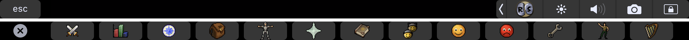
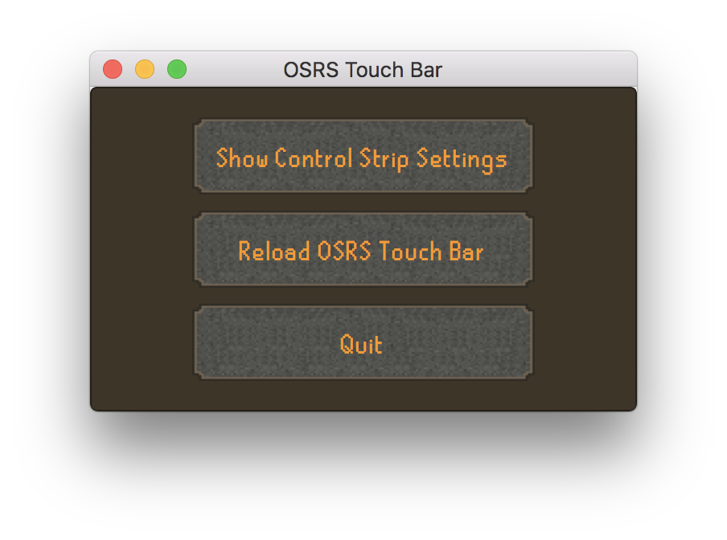

# OSRS-touch-bar
OSRS-touch-bar displays [Old School RuneScape](http://oldschool.runescape.com) interface icons and maps them to the corresponding function keys in-game. 

# Download

[Download the latest release here.](https://github.com/pg8wood/OSRS-touch-bar/releases/download/1.0/OSRS-touch-bar-1.0.dmg)

# Usage

On launch, your Touch Bar will display the interface shown above until you quit OSRS-touch-bar (even if you switch apps). 

Should you need to access the Control Strip, simply enable it with the `Control Strip` toggle.

If you close the Touch Bar app, you can reload it with the `Reload` button.

Quitting the app will restore your original Control Strip settings.

<!--Centered Image-->

  

Note: if you have your Touch Bar configured to show only the "Expanded Control Strip" or "F1, F2, etc. Keys", OSRS Touch Bar cannot display the RuneScape UI in the Touch Bar! This can be toggled in __System Preferences &rarr; Keyboard__. 

## API Note
It should be noted that, like other "global" Touch Bar apps ([BetterTouchTool](https://www.boastr.net/), [Touch Bär](https://github.com/a2/touch-baer), etc), OSRS-touch-bar goes against Apple's current Touch Bar guidelines.

In order to use OSRS-touch-bar in conjunction with the RuneScape client, a private API is necessary to circumvent Apple's restrictions on hiding the Control Strip. As such, OSRS-touch-bar links against a private Apple framework `DFRFoundation.framework`. 

__tl;dr__ Since the OSRS client doesn't have its own App Controls, this app adds its own App Controls in the (otherwise unused) Touch Bar space.

Happy 'Scaping! 

