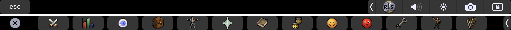

# OSRS-touch-bar
OSRS-touch-bar displays [Old School RuneScape](http://oldschool.runescape.com) interface icons and maps them to the corresponding function keys in-game. 

# Usage
On launch, your Touch Bar will display the interface shown above until you quit OSRS-touch-bar (even if you switch apps). 

Should you need the Control Strip or other "normal" Touch Bar functionality, simply click one of the buttons in the app and the Touch Bar will update accordingly. 

<!--Centered Image-->

  

## Privileges
OSRS-touch-bar will request assistive access on first launch. This is required for the scripts OSRS-touch-bar uses to temporarily toggle the Control Stip's visibility while you are using the app. 

## API Note
It should be noted that this application, like other "global" Touch Bar apps ([BetterTouchTool](https://www.boastr.net/), [Touch Bär](https://github.com/a2/touch-baer), etc), OSRS-touch-bar goes against Apple's guidelines.

In order to use OSRS-touch-bar in conjunction with the RuneScape client, a private API is necessary to circumvent Apple's restrictions on hiding the Control Strip. As such, OSRS-touch-bar links against a private Apple framework `DFRFoundation.framework`. 

__tl;dr__ Apple probably wouldn't put this app on the Mac App Store solely because it hides the Control Strip. 

Happy 'Scaping! 

